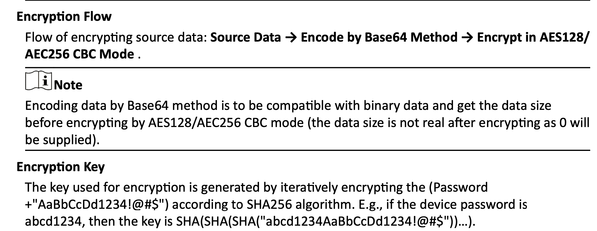

# node-hikvision-api

[]()
[]()
[]()

NodeJS Module for communication with HikVision IP Cameras.

Now updated with Typescript and proper ISAPI calls.


## Status
**Work in Progress**

### Working:

* View/update stream channel parameters
  * Partial validation before sending XML is possible, see example 5
* Get device status
* Enable/disable ONVIF
* Add/remove ONVIF users
* Checking for day mode/night mode
* Camera alarm handling (see below)

### Encryption:

Though HikVision's ISAPI protocol supports security using URL parameters, I was unable to get it working properly.
Anyone is welcome to pick up where I left off in `src/lib/hikvision.encryption.ts`.

The ISAPI [spec](./repo/isapi.pdf) includes the full steps in Chapter 3, but this is the general idea:



**Without encryption** one should _not_ use this library to pass sensitive data _at all_ even if you are using HTTPS.


### Notes

**There are major differences between this library and the original one**

For instance, the previous version of this library had PTZ functionalities,
however this is not within the scope of this library. In my own opinion, you should be using
ONVIF for those functions.

### Roadmap

* Implement proper sensitive data encryption
* Write unit tests
* Implement NetworkInterface validation
* Return PTZ capabilities
* Basic error handling (right now the axios ref is thrown all the way up the stack)
* Clean up alarm notification handling


## Getting Started:

Installing:
```shell
npm i @copcart/node-hikvision-api
```

Importing:
```typescript
import { HikVision } from '@copcart/node-hikvision-api';
```

Configuring:
```typescript
const camera = new HikVision({
  username: 'admin',     // Required
  password: 'password',  // Required
  host: '192.168.1.64',  // Required
  debug: true,           // Optional, defaults to false
  port: 80,              // Optional, defaults to 80
  reconnectAfter: 30000, // Optional, defaults to 30000 (30s)
  protocol: 'http',      // Optional, defaults to 'http'
});
```


Additionally, you can run examples (available in `examples/`) like shown:

```shell
npm run example:basic CAMERA_IP CAMERA_PASSWORD CAMERA_USERNAME  
 ```

There are more examples available as npm scripts, so please check package.json

